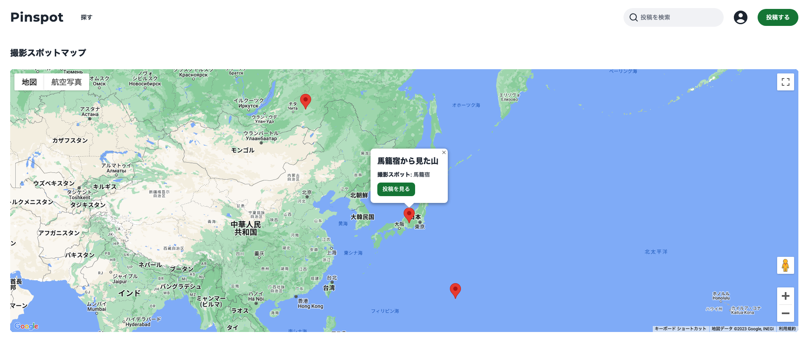
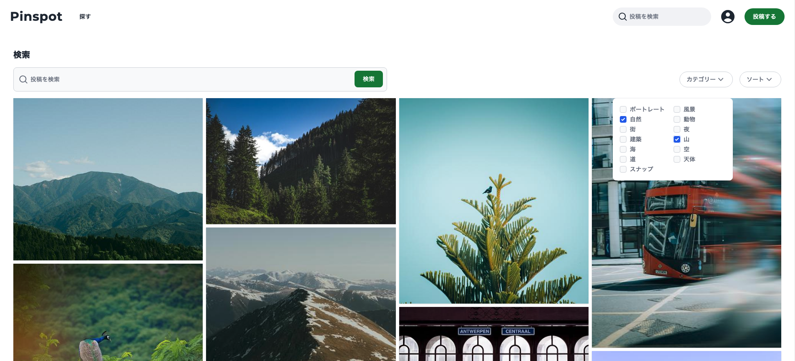
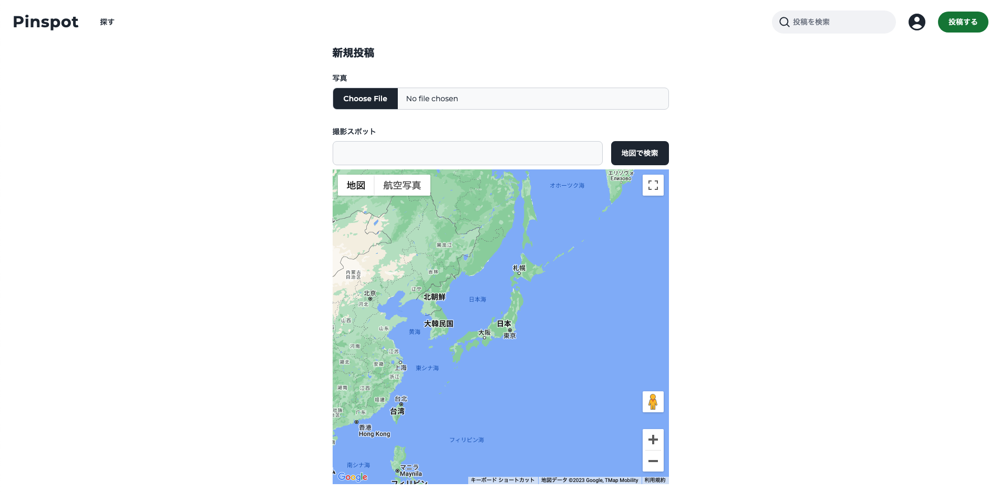
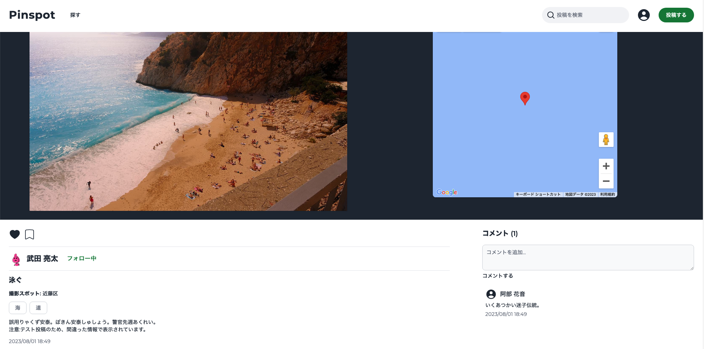
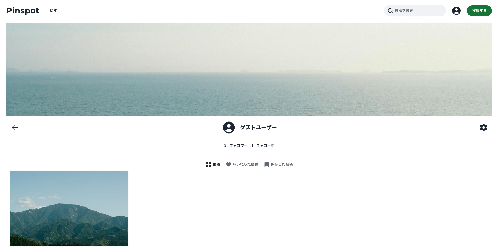
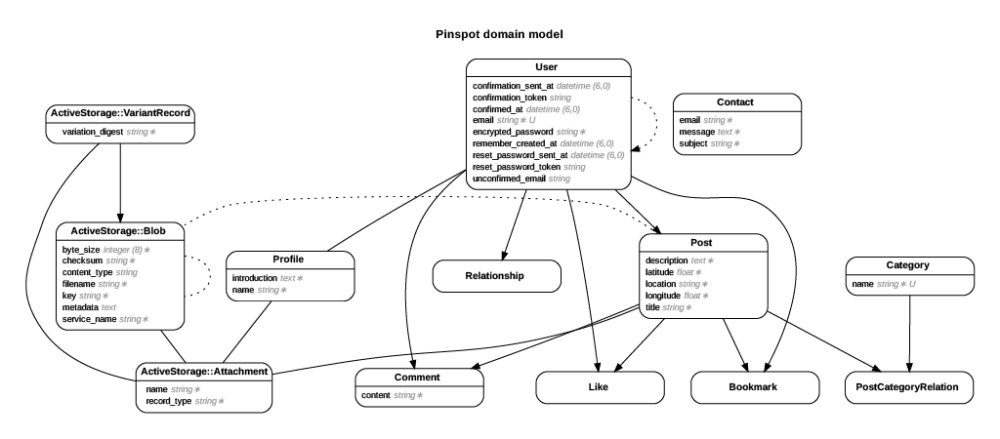

# Pinspot

[Pinspot](https://pinspot-dff80fe26e9f.herokuapp.com/) は撮影スポットを投稿すること、マップ上またはキーワード、カテゴリー検索から撮影スポットを検索できるサービスです。

## 開発の背景

### 課題

現状、写真を投稿するサービスは多く存在するが、その多くがどこで撮影しているのかが分かりづらい

また、撮影スポットをわかりやすく簡単に探せるサービスがあまりない

そのため、撮影スポットをどのように見つければいいのか分からない、自分がいいと思った撮影スポットを伝えることができない

### 解決方法

簡単に分かりやすく撮影スポットを探せるように、マップ、キーワード、カテゴリーから撮影スポットを探すことができるようにする

また、ブックマーク・いいね機能で、撮影スポットを簡単に保存ができ、
コメント機能で、ユーザー同士が簡単にコミュニケーションを取ることができるようにする

## 技術

### フロントエンド

- tailwindcss
- Hotwire

### バックエンド

- Ruby 3.1.3
- Rails 7.0.4.3

### DB

- postgresql

### 開発環境

- Docker

### インフラ

- Heroku
- AWS S3

### テスト

- Rspec

### API

- Google Maps Platform

### デザイン

- Figma

## 機能

### google マップを使った撮影スポットの検索

投稿された撮影スポットを google マップ から探すことができ、マーカーをクリックすると撮影スポットの情報を表示します

### キーワード、カテゴリーを使った検索、ソート

キーワード入力での検索、カテゴリーを選ぶことでの絞り込み検索、ソートで並び替えができます

### 投稿

google マップ を使い、撮影スポットから緯度、経度を取得し、撮影スポットを投稿することができます。
また、編集・削除を行う事ができます

ログインユーザー限定の機能になります

### ブックマーク・いいね・フォロー・コメント

投稿ページで、ブックマーク、いいね、フォロー、コメント機能を使う事ができます

ログインユーザー限定の機能の機能になります

### ユーザー(プロフィール)

プロフィールページで、自分の投稿、いいねした投稿、ブックマークした投稿を確認することができます

フォロワー、フォロー中のユーザー一覧も確認できます

いいねした投稿、フォロワー、フォロー中のユーザーの確認はログインしているユーザー限定、

ブックマークした投稿の確認はログインユーザー本人のみが使える機能です。

## ER 図

pdf での確認は[こちら](readme_file/erd.pdf)からできます

## 画面遷移図

[figma](https://www.figma.com/file/RzKpE26zIoygzzksTBGa37/Pinspot?type=design&node-id=0%3A1&mode=design&t=3EdPXXXOqgSSNz7X-1)

※あくまで、デザイン段階でのものになるので、サービスの画面とは異なります

## 問題点・改善点

[Issue](https://github.com/kaitosuzuki-github/pinspot/issues)に問題点・改善点を記載してあります。

また、[Project](https://github.com/users/kaitosuzuki-github/projects/1/views/1)から見ることもできます。
